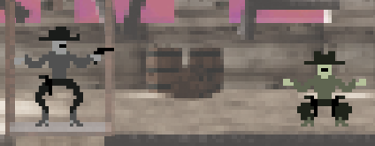

# gunslinger-glitch
A quickdraw duel against cutting edge A.I. - can you tell which faces are human, and which are synthesized?

You will meet gunslingers with the photos and quotes of real humans, and amongst them, traitorous androids with generated photos and quotes.

This game was made solo in 48hrs for the Ludum Dare game jam #49 with the prompt 'unstable'.
Play it here: https://ugly-robot.itch.io/gunslinger-glitch
And see the submission here: https://ldjam.com/events/ludum-dare/49/gunslinger-glitch

# Trailer

# Screenshots

 
 

# Credits
You can view the ['human thoughts'](Assets/Resources/human-thoughts.txt) for cediting the [human](https://everydaypower.com/deep-quotes/) [quotes](https://parade.com/940913/parade/funny-quotes/).
All human portraits were taking from the [imdb-wiki database](https://data.vision.ee.ethz.ch/cvl/rrothe/imdb-wiki/)
All android quotes were generated by [Open AI's GPT3](https://openai.com/blog/gpt-3-apps/)
All android portraits were generated by [this-person-does-not-exist GAN](https://thispersondoesnotexist.com/)
The boss portraits were generated by [MIT Nightmare GAN](http://nightmare.mit.edu/)

Unity was used for the game engine
Blender was used for the backgrounds, trailer, etc.
Imagemagick was used for the portrait effects. 
Piskel was used for the character sprites.

Thank you to the researchers and voulenteers that make fun little projects like this possible!
